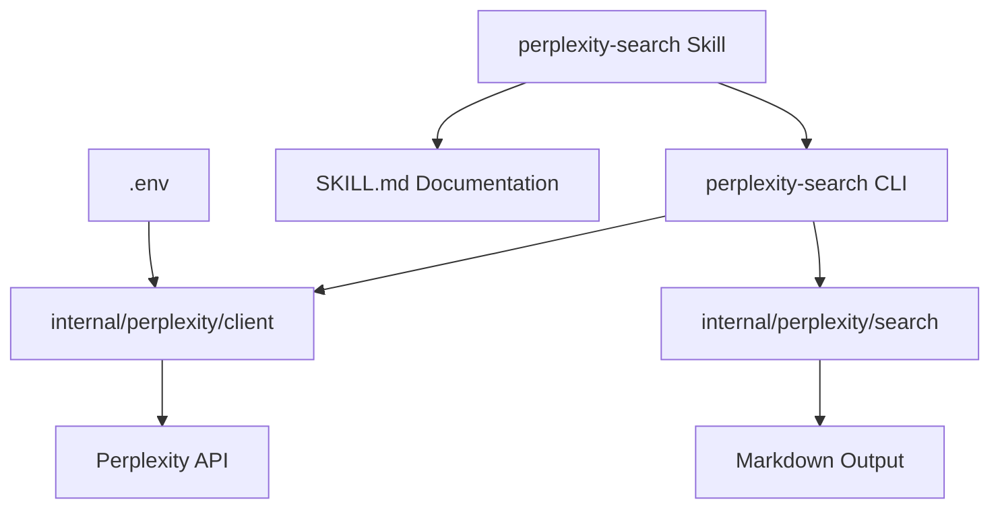

## Context

The ddg-search project currently provides:
- `ddg-search`: Web search via DuckDuckGo HTML scraping (no API key required)
- `page-dump`: URL fetching and HTML to markdown conversion

Perplexity API offers an alternative web search service that:
- Requires an API key
- Provides AI-powered search results with better understanding
- Returns structured responses with citations
- Has rate limits based on API tier

This design adds a new CLI command and skill for Perplexity search, giving users more options for web search with different trade-offs.

## Goals / Non-Goals

**Goals:**
- Create a CLI command `perplexity-search` that queries the Perplexity API
- Implement Perplexity API client with proper error handling
- Support API key retrieval from environment variable (.env file)
- Create a Claude Code skill exposing Perplexity search functionality
- Follow existing project patterns (urfave/cli, similar structure to ddg-search)
- Update README.md with documentation

**Non-Goals:**
- Replacing or modifying existing ddg-search functionality
- Implementing full Perplexity API features (focus on search only)
- Supporting other search providers (only Perplexity)
- Implementing caching or local storage of results

## Decisions

### CLI Command: `cmd/perplexity-search/main.go`

**Rationale:** Following the existing pattern, create a new command directory under `cmd/`. This keeps the project structure consistent and allows independent binaries for each search provider.

**Alternative considered:** Adding Perplexity as a flag to ddg-search - rejected because different search providers have different APIs, parameters, and behaviors. Separate commands are cleaner and more maintainable.

### API Client: `internal/perplexity/` Package

**Rationale:** Create a dedicated package for Perplexity API interactions, similar to `internal/search/` for DuckDuckGo. This separates concerns and makes the code testable.

**Alternative considered:** Direct API calls in main.go - rejected because this makes testing difficult and violates separation of concerns.

### API Key from Environment Variable

**Rationale:** Use `PERPLEXITY_API_KEY` environment variable, loaded from `.env` file. This follows security best practices (never hardcode API keys) and is already supported by the project (`.env.example` exists).

**Alternative considered:** Command-line flag for API key - rejected because this exposes the key in shell history and process listings.

### Skill Location: `skills/perplexity-search/`

**Rationale:** Following the existing `skills/ddg-search/` pattern, create a separate skill directory for Perplexity search. This allows independent skill management and clear separation of functionality.

**Alternative considered:** Adding to existing ddg-search skill - rejected because the skills should be independent, allowing users to choose which search provider to use.

### Output Format: Markdown

**Rationale:** Consistent with ddg-search, output results in markdown format for LLM consumption. This makes the tool useful in automation and AI contexts.

**Alternative considered:** JSON output - rejected because markdown is the project standard and more readable for humans.

## Risks / Trade-offs

**API key required** → Users must obtain a Perplexity API key; this is documented in SKILL.md and README.md. The free tier has limits that users should be aware of.

**API rate limits** → Perplexity API has rate limits; the client should handle rate limit errors gracefully and provide clear error messages.

**API changes** → Perplexity API may change over time; the client should be designed to be easily updatable. Consider versioning the API endpoint.

**Cost** → Perplexity API may have costs associated with usage; users are responsible for their own API usage. This is documented clearly.

**Maintenance burden** → Adding another search provider increases maintenance; however, the code is isolated to specific packages, minimizing impact on existing code.

## Architecture

## API Integration

The Perplexity API client will:
1. Use HTTP client with proper timeout configuration
2. Include API key in Authorization header
3. Handle API errors (rate limits, invalid keys, etc.)
4. Parse JSON responses and extract search results
5. Format results as markdown for output

## Error Handling

- Missing API key: Clear error message directing user to .env file
- Invalid API key: Clear error message from API
- Rate limit exceeded: Display rate limit info from API response
- Network errors: Retry with exponential backoff (similar to ddg-search)
- Invalid query: Validate before sending to API
